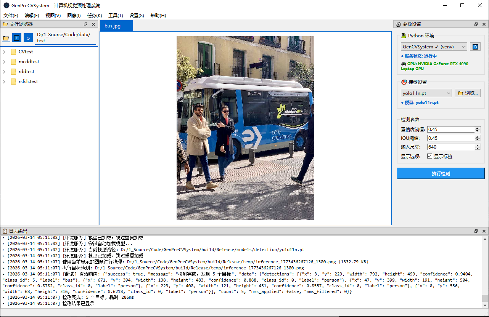

<div align="center">

# GenPreCVSystem

**Industrial Computer Vision Preprocessing System**

**工业级计算机视觉预处理系统**

[](https://www.qt.io/)
[](https://isocpp.org/)
[](https://cmake.org/)
[](https://www.microsoft.com/windows)
[](LICENSE)



</div>

---

## Language / 语言

<details>
<summary><b>English</b></summary>

## Overview

GenPreCVSystem is an industrial-grade computer vision preprocessing application built with Qt 6.9 and C++17. It provides a comprehensive solution for image preprocessing, CV task configuration, and model inference.

## Features

### Task Management
- **8 CV Task Types** with dedicated parameter panels
  - Image Classification - ResNet, EfficientNet, ViT
  - Object Detection - YOLO, Faster R-CNN, SSD
  - Semantic Segmentation - DeepLab, U-Net, FCN
  - Instance Segmentation - Mask R-CNN
  - Keypoint Detection - MMPose, OpenPose
  - Image Enhancement - Brightness, Contrast, Saturation
  - Image Denoising - Gaussian, Bilateral filtering
  - Edge Detection - Sobel, Canny, Laplacian

### User Interface
- Multi-tab support for simultaneous image editing
- Drag & drop support for files and folders
- Clipboard operations (copy/paste images)
- Undo/Redo with 50-step history per tab
- Real-time log output panel

### Image Processing
- Basic: Grayscale, Invert, Binarize
- Transform: Rotate (90° L/R), Flip (H/V)
- Filters: Blur, Sharpen, Edge Detection

### File Management
- Left panel file tree with navigation
- Right-click context menu
- Image file filtering

## Quick Start

### Prerequisites
- Windows 10/11
- Visual Studio 2022
- Qt 6.9.3 (msvc2022_64)
- CMake 3.16+

### Build

```bash
# Configure with CMake preset
cmake --preset msvc-release

# Build
cmake --build build --config Release
```

### LibTorch Setup (Optional)

For deep learning model inference:

```powershell
cd third_party
.\download_libtorch.ps1
```

See [third_party/README.md](third_party/README.md) for details.

### Deploy

```batch
deploy.bat
```

The executable will be at: `dist/GenPreCVSystem/GenPreCVSystem.exe`

## Project Structure

```
GenPreCVSystem/
├── src/                           # Source code
│   ├── main.cpp                   # Entry point
│   ├── ui/                        # UI components
│   │   └── mainwindow.*           # Main window
│   ├── views/                     # View components
│   │   ├── imageview.*            # Image viewer
│   │   ├── filetreeview.*         # File tree
│   │   └── detectionresultdialog.*# Detection results
│   ├── controllers/               # Controllers
│   │   ├── taskcontroller.*       # Task management
│   │   ├── imagecontroller.*      # Image operations
│   │   └── filecontroller.*       # File operations
│   ├── models/                    # Data models
│   │   ├── tasktypes.h            # Task type definitions
│   │   └── modelinference.*       # Model inference
│   ├── utils/                     # Utilities
│   │   ├── imageprocessor.*       # Image processing
│   │   ├── yoloservice.*          # YOLO service
│   │   └── clipboardhelper.*      # Clipboard utilities
│   ├── widgets/                   # Custom widgets
│   └── resources/                 # Resources
│       ├── models/                # Model files (git-ignored)
│       └── *.ts                   # Translations
├── third_party/                   # Third-party libraries
├── build/                         # Build directory
├── dist/                          # Distribution output
├── CMakeLists.txt                 # CMake configuration
└── deploy.bat                     # Deployment script
```

## Keyboard Shortcuts

| Action | Shortcut |
|--------|----------|
| Open Image | `Ctrl+O` |
| Open Folder | `Ctrl+D` |
| Close Tab | `Ctrl+W` |
| Save | `Ctrl+S` |
| Save As | `Ctrl+Shift+S` |
| Copy | `Ctrl+C` |
| Paste | `Ctrl+V` |
| Rotate Left | `Ctrl+L` |
| Rotate Right | `Ctrl+R` |
| Flip Horizontal | `Ctrl+H` |
| Flip Vertical | `Ctrl+Shift+H` |
| Zoom In | `Ctrl++` |
| Zoom Out | `Ctrl+-` |
| Fit Window | `Ctrl+F` |
| Actual Size | `Ctrl+1` |
| Run Task | `F5` |
| Stop Task | `Shift+F5` |
| Settings | `Ctrl+,` |
| Undo | `Ctrl+Z` |
| Redo | `Ctrl+Y` |

## Usage Guide

### Opening Images
1. **Menu**: File → Open Image (`Ctrl+O`)
2. **Folder**: File → Open Folder (`Ctrl+D`), then double-click image
3. **Drag & Drop**: Drag files/folders to file browser

### Editing Images
1. **Basic**: Use Edit menu or shortcuts for rotate/flip
2. **Processing**: Use Image menu for filters
3. **History**: `Ctrl+Z` undo, `Ctrl+Y` redo (50 steps max)

### CV Tasks
1. **Select Task**: Choose from Task menu
2. **Configure**: Adjust parameters in right panel
3. **Run**: Click Run (`F5`)

## Model Inference

### Loading a Classification Model

```cpp
#include "models/modelinference.h"

using namespace GenPreCVSystem::Models;

ImageClassificationModel model;
model.setClassLabels({"cat", "dog", "bird"});
model.setTopK(5);
model.setDevice(true);  // GPU

if (model.loadModel("path/to/resnet18.pt")) {
    QImage image("path/to/image.jpg");
    ClassificationResult result = model.classify(image);

    if (result.success) {
        qDebug() << "Predicted:" << result.className;
        qDebug() << "Confidence:" << result.confidence;
        qDebug() << "Time:" << result.inferenceTime << "ms";
    }
}
```

### Exporting Python Models to TorchScript

```python
import torch
import torchvision.models as models

model = models.resnet18(pretrained=True)
model.eval()

example_input = torch.rand(1, 3, 224, 224)
traced_model = torch.jit.trace(model, example_input)
traced_model.save("resnet18.pt")
```

### Supported Models
- **Classification**: ResNet, EfficientNet, Vision Transformer
- **Detection**: YOLO (v8, v11, v26), Faster R-CNN, SSD
- **Segmentation**: DeepLab, U-Net, FCN
- **Instance Seg**: Mask R-CNN

## Tech Stack

| Component | Technology |
|-----------|------------|
| Framework | Qt 6.9.3 |
| Language | C++17 |
| Build System | CMake 3.16+ |
| Compiler | MSVC 2022 |
| Deep Learning | LibTorch 2.1.0 (optional) |
| Architecture | MVC Pattern |

## Contributing

Contributions are welcome! Please feel free to submit issues and pull requests.

## License

Copyright © 2024 GenPreCVSystem. All rights reserved.

</details>

<details>
<summary><b>中文</b></summary>

## 项目概述

GenPreCVSystem 是一款基于 Qt 6.9 和 C++17 开发的工业级计算机视觉预处理应用程序，提供图像预处理、CV任务配置和模型推理的综合解决方案。

## 功能特性

### 任务管理
- **8种CV任务类型**，配备专属参数配置面板
  - 图像分类 - ResNet, EfficientNet, ViT
  - 目标检测 - YOLO, Faster R-CNN, SSD
  - 语义分割 - DeepLab, U-Net, FCN
  - 实例分割 - Mask R-CNN
  - 关键点检测 - MMPose, OpenPose
  - 图像增强 - 亮度、对比度、饱和度调整
  - 图像去噪 - 高斯滤波、双边滤波
  - 边缘检测 - Sobel, Canny, Laplacian

### 用户界面
- 多标签页支持，可同时编辑多张图片
- 拖放支持，可直接拖入文件或文件夹
- 剪贴板操作（复制/粘贴图片）
- 撤销/重做，每标签页独立50步历史
- 实时日志输出面板

### 图像处理
- 基础操作：灰度化、反色、二值化
- 变换操作：旋转（左/右90°）、翻转（水平/垂直）
- 滤镜效果：模糊、锐化、边缘检测

### 文件管理
- 左侧文件树视图，支持导航
- 右键上下文菜单
- 图片文件过滤

## 快速开始

### 环境要求
- Windows 10/11
- Visual Studio 2022
- Qt 6.9.3 (msvc2022_64)
- CMake 3.16+

### 构建

```bash
# 使用 CMake 预设配置
cmake --preset msvc-release

# 构建
cmake --build build --config Release
```

### LibTorch 配置（可选）

如需深度学习模型推理功能：

```powershell
cd third_party
.\download_libtorch.ps1
```

详见 [third_party/README.md](third_party/README.md)

### 部署

```batch
deploy.bat
```

可执行文件位于：`dist/GenPreCVSystem/GenPreCVSystem.exe`

## 项目结构

```
GenPreCVSystem/
├── src/                           # 源代码目录
│   ├── main.cpp                   # 程序入口
│   ├── ui/                        # UI组件
│   │   └── mainwindow.*           # 主窗口
│   ├── views/                     # 视图组件
│   │   ├── imageview.*            # 图片查看器
│   │   ├── filetreeview.*         # 文件树
│   │   └── detectionresultdialog.*# 检测结果对话框
│   ├── controllers/               # 控制器
│   │   ├── taskcontroller.*       # 任务管理
│   │   ├── imagecontroller.*      # 图像操作
│   │   └── filecontroller.*       # 文件操作
│   ├── models/                    # 数据模型
│   │   ├── tasktypes.h            # 任务类型定义
│   │   └── modelinference.*       # 模型推理
│   ├── utils/                     # 工具类
│   │   ├── imageprocessor.*       # 图像处理
│   │   ├── yoloservice.*          # YOLO服务
│   │   └── clipboardhelper.*      # 剪贴板工具
│   ├── widgets/                   # 自定义控件
│   └── resources/                 # 资源文件
│       ├── models/                # 模型文件（git忽略）
│       └── *.ts                   # 翻译文件
├── third_party/                   # 第三方库
├── build/                         # 构建目录
├── dist/                          # 分发输出
├── CMakeLists.txt                 # CMake配置
└── deploy.bat                     # 部署脚本
```

## 快捷键

| 功能 | 快捷键 |
|------|--------|
| 打开图片 | `Ctrl+O` |
| 打开文件夹 | `Ctrl+D` |
| 关闭标签 | `Ctrl+W` |
| 保存 | `Ctrl+S` |
| 另存为 | `Ctrl+Shift+S` |
| 复制 | `Ctrl+C` |
| 粘贴 | `Ctrl+V` |
| 向左旋转 | `Ctrl+L` |
| 向右旋转 | `Ctrl+R` |
| 水平翻转 | `Ctrl+H` |
| 垂直翻转 | `Ctrl+Shift+H` |
| 放大 | `Ctrl++` |
| 缩小 | `Ctrl+-` |
| 适应窗口 | `Ctrl+F` |
| 实际大小 | `Ctrl+1` |
| 运行任务 | `F5` |
| 停止任务 | `Shift+F5` |
| 设置 | `Ctrl+,` |
| 撤销 | `Ctrl+Z` |
| 重做 | `Ctrl+Y` |

## 使用说明

### 打开图片
1. **菜单方式**：文件 → 打开图片 (`Ctrl+O`)
2. **文件夹方式**：文件 → 打开文件夹 (`Ctrl+D`)，然后双击图片
3. **拖放方式**：直接拖入文件或文件夹到文件浏览器

### 编辑图片
1. **基本编辑**：使用编辑菜单或快捷键进行旋转、翻转
2. **图像处理**：使用图像菜单应用滤镜效果
3. **历史记录**：`Ctrl+Z` 撤销，`Ctrl+Y` 重做（最多50步）

### CV任务处理
1. **选择任务**：从任务菜单选择CV任务类型
2. **配置参数**：在右侧参数面板调整参数
3. **运行处理**：点击运行 (`F5`)

## 模型推理

### 加载图像分类模型

```cpp
#include "models/modelinference.h"

using namespace GenPreCVSystem::Models;

ImageClassificationModel model;
model.setClassLabels({"猫", "狗", "鸟"});
model.setTopK(5);
model.setDevice(true);  // 使用GPU

if (model.loadModel("path/to/resnet18.pt")) {
    QImage image("path/to/image.jpg");
    ClassificationResult result = model.classify(image);

    if (result.success) {
        qDebug() << "预测类别:" << result.className;
        qDebug() << "置信度:" << result.confidence;
        qDebug() << "推理时间:" << result.inferenceTime << "ms";
    }
}
```

### 将Python模型导出为TorchScript

```python
import torch
import torchvision.models as models

model = models.resnet18(pretrained=True)
model.eval()

example_input = torch.rand(1, 3, 224, 224)
traced_model = torch.jit.trace(model, example_input)
traced_model.save("resnet18.pt")
```

### 支持的模型
- **图像分类**: ResNet, EfficientNet, Vision Transformer
- **目标检测**: YOLO (v8, v11, v26), Faster R-CNN, SSD
- **语义分割**: DeepLab, U-Net, FCN
- **实例分割**: Mask R-CNN

## 技术栈

| 组件 | 技术 |
|------|------|
| 框架 | Qt 6.9.3 |
| 语言 | C++17 |
| 构建系统 | CMake 3.16+ |
| 编译器 | MSVC 2022 |
| 深度学习 | LibTorch 2.1.0 (可选) |
| 架构模式 | MVC |

## 贡献指南

欢迎提交 Issue 和 Pull Request！

## 许可证

Copyright © 2024 GenPreCVSystem. All rights reserved.

</details>

---

<div align="center">

**Made with ❤️ by GenPreCVSystem Team**

</div>
