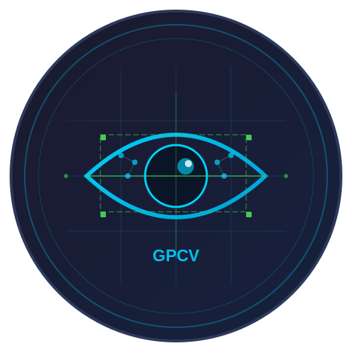
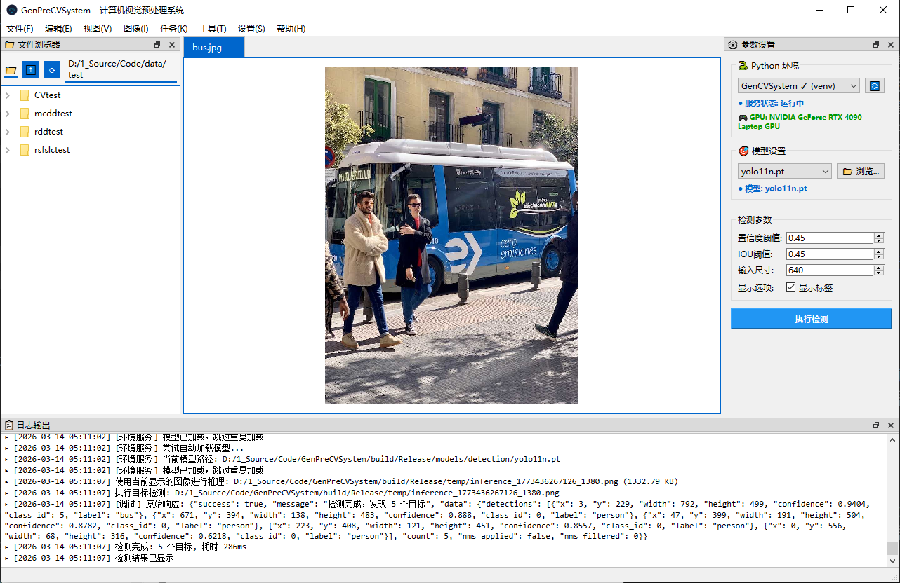

<div align="center">



# GenPreCVSystem

**工业级计算机视觉预处理系统**

*Industrial Computer Vision Preprocessing System*

[](https://www.qt.io/)
[](https://isocpp.org/)
[](https://cmake.org/)
[](https://www.python.org/)
[](https://www.microsoft.com/windows)
[](LICENSE)



[下载](#下载安装) • [功能特性](#功能特性) • [快速开始](#快速开始) • [使用指南](#使用指南) • [API文档](#api文档)

</div>

---

## 简介

**GenPreCVSystem** 是一款专为计算机视觉工程师和研究人员设计的工业级图像预处理软件。基于 **Qt 6.9** 和 **C++17** 构建，结合 **Python + Ultralytics YOLO** 后端，提供从图像处理到深度学习推理的一站式解决方案。

### 为什么选择 GenPreCVSystem？

- **开箱即用** - 内置 10+ 种 CV 任务，无需编写代码
- **工业级架构** - Qt/C++ 前端 + Python 后端，性能与灵活性兼顾
- **模型兼容** - 支持 YOLOv8/v9/v10/v11 全系模型
- **批量处理** - 支持文件夹级批量推理，提升工作效率
- **中文优化** - 原生中文界面，完整中文文档

---

## 下载安装

### 系统要求

| 组件 | 最低要求 | 推荐配置 |
|------|---------|---------|
| 操作系统 | Windows 10 | Windows 11 |
| 内存 | 4 GB | 8 GB+ |
| 显卡 | 支持 CUDA 的 NVIDIA 显卡（可选） | RTX 3060+ |
| Python | 3.8+ | 3.10+ |

### 方式一：下载预编译版本

> 即将发布，敬请期待

### 方式二：从源码构建

```bash
# 1. 克隆仓库
git clone https://github.com/jinweixia03/GenPreCVSystem.git
cd GenPreCVSystem

# 2. 配置环境
cmake --preset msvc-release

# 3. 编译
cmake --build build --config Release

# 4. 运行
./build/Release/GenPreCVSystem.exe
```

详细构建说明见 [BUILD.md](docs/BUILD.md)

---

## 功能特性

### 支持的 CV 任务

| 任务类型 | 描述 | 适用场景 |
|---------|------|---------|
| 🎯 **目标检测** | 边界框检测 + 置信度 | 工业质检、安防监控 |
| 🔲 **语义分割** | 像素级分割 + 多边形 | 医学影像、遥感分析 |
| 🏷️ **图像分类** | Top-K 分类结果 | 产品分类、内容审核 |
| 🦴 **关键点检测** | 人体/物体姿态估计 | 运动分析、人机交互 |
| 🛣️ **道路病害检测** | 专用道路缺陷检测 | 市政维护、公路巡检 |
| 🔴 **井盖病害检测** | 井盖损坏识别 | 城市管理、基础设施 |
| 🛰️ **遥感小样本分类** | Few-Shot Learning | 遥感影像分析 |
| ✨ **图像增强** | 亮度/对比度/饱和度 | 图像预处理 |
| 🫧 **图像去噪** | 多种去噪算法 | 图像修复 |
| 📐 **边缘检测** | Sobel/Canny/Laplacian | 特征提取 |

### 图像处理功能

- **基础变换**：灰度化、反色、二值化、旋转、翻转
- **滤镜效果**：高斯模糊、锐化、边缘检测
- **参数调整**：亮度、对比度、饱和度、锐度
- **撤销/重做**：每标签页 50 步历史记录

### 文件与导出

- **多标签页**：同时处理多张图片
- **批量处理**：整文件夹自动推理
- **导出格式**：JSON / CSV / XML / 标注图片
- **快捷操作**：拖拽打开、最近文件、快捷键支持

---

## 快速开始

### 1. 配置 Python 环境

```bash
# 创建 Conda 环境
conda create -n GenPreCV python=3.10 -y
conda activate GenPreCV

# 安装依赖
pip install ultralytics torch torchvision

# 验证安装
python -c "import ultralytics; print(ultralytics.__version__)"
```

### 2. 启动软件

```bash
./GenPreCVSystem.exe
```

首次启动会自动扫描可用的 Python 环境。

### 3. 加载模型

1. 在右侧面板选择带 ✓ 标记的 Python 环境
2. 点击「选择模型」加载 `.pt` 文件
3. 调整置信度阈值（默认 0.25）

### 4. 运行推理

- **单张图片**：打开图片 → 点击运行 (F5)
- **批量处理**：工具 → 批量处理 → 选择文件夹

### 5. 导出结果

检测完成后，点击「导出结果」选择格式保存。

---

## 使用指南

### 界面布局

```
┌─────────────────────────────────────────────────────────────┐
│  菜单栏  │  工具栏                                          │
├─────────┴───────────────────────────────────────────────────┤
│  📁 文件树  │        🖼️ 图像显示区           │  ⚙️ 参数面板   │
│  (左侧面板)  │         (中央区域)             │  (右侧面板)   │
│             │                                │              │
│  - 快速浏览  │  - 支持缩放/平移               │  - 环境选择   │
│  - 双击打开  │  - 实时显示检测结果             │  - 模型配置   │
│  - 右键菜单  │  - 边界框/掩膜可视化            │  - 运行控制   │
├─────────────┴────────────────────────────────┴──────────────┤
│  📝 日志输出区                                               │
└─────────────────────────────────────────────────────────────┘
```

### 快捷键

| 操作 | 快捷键 | 操作 | 快捷键 |
|------|--------|------|--------|
| 打开图片 | `Ctrl+O` | 运行任务 | `F5` |
| 打开文件夹 | `Ctrl+D` | 停止任务 | `Shift+F5` |
| 保存 | `Ctrl+S` | 放大 | `Ctrl++` |
| 撤销 | `Ctrl+Z` | 缩小 | `Ctrl+-` |
| 重做 | `Ctrl+Y` | 适应窗口 | `Ctrl+F` |
| 向左旋转 | `Ctrl+L` | 实际大小 | `Ctrl+1` |
| 向右旋转 | `Ctrl+R` | 设置 | `Ctrl+,` |

### 批量处理流程

1. **选择输入**：文件夹或图片列表
2. **配置参数**：模型、置信度、导出格式
3. **开始处理**：实时监控进度
4. **查看结果**：统计汇总 + 详细日志
5. **导出数据**：JSON/CSV/XML + 标注图片

### 配置说明

**文件 → 设置 (Ctrl+,)**

| 设置项 | 说明 |
|--------|------|
| 默认打开目录 | 左侧文件浏览器默认路径 |
| 默认导出目录 | 结果保存默认位置 |
| 最近文件数量 | 菜单中显示的历史文件数 |

---

## 技术架构

### 系统架构

```
┌─────────────────────────────────────────────────────────────┐
│                    GenPreCVSystem (Qt/C++)                   │
│  ┌──────────┐  ┌──────────┐  ┌──────────┐  ┌──────────┐    │
│  │  图像处理  │  │  文件管理  │  │  任务调度  │  │  UI渲染  │    │
│  └──────────┘  └──────────┘  └──────────┘  └──────────┘    │
└────────────────────────┬────────────────────────────────────┘
                         │ QProcess (JSON IPC)
                         ▼
┌─────────────────────────────────────────────────────────────┐
│                  Python Inference Service                    │
│  ┌──────────────┐  ┌──────────────┐  ┌──────────────┐      │
│  │  dl_service  │  │  fsl_service │  │  base_service│      │
│  │  (YOLO推理)   │  │  (小样本学习) │  │  (公共服务)   │      │
│  └──────────────┘  └──────────────┘  └──────────────┘      │
│                         │                                   │
│                         ▼                                   │
│              Ultralytics + PyTorch + CUDA                   │
└─────────────────────────────────────────────────────────────┘
```

### 核心技术栈

| 层级 | 技术 | 用途 |
|------|------|------|
| 前端框架 | Qt 6.9.3 | GUI 界面、多线程、信号槽 |
| 编程语言 | C++17 | 高性能图像处理 |
| 构建工具 | CMake 3.16+ | 跨平台构建 |
| 推理后端 | Python 3.10+ | 深度学习模型推理 |
| 模型框架 | Ultralytics YOLO | 目标检测/分割/分类 |
| 深度学习 | PyTorch | 模型加载与推理 |
| GPU 加速 | CUDA (可选) | NVIDIA GPU 加速 |

---

## API 文档

### C++ 核心类

```cpp
// 深度学习推理服务
#include "services/inference/dlservice.h"

GenPreCVSystem::Utils::DLService* service =
    new GenPreCVSystem::Utils::DLService(this);

// 扫描 Python 环境
auto envs = service->scanEnvironments();

// 启动服务
service->setEnvironmentPath("/path/to/python.exe");
service->start();

// 加载模型
service->loadModel("yolov8n.pt");

// 执行检测
auto result = service->detect("image.jpg", 0.25, 0.45, 640);
```

### Python 服务接口

```python
# 请求格式
{
    "command": "detect",
    "image_path": "path/to/image.jpg",
    "conf_threshold": 0.25,
    "iou_threshold": 0.45,
    "image_size": 640
}

# 响应格式
{
    "success": true,
    "message": "检测完成",
    "data": {
        "detections": [...],
        "inference_time": 0.045
    }
}
```

完整 API 文档见 [docs/API.md](docs/API.md)

---

## 模型支持

### 支持的模型格式

- `.pt` - PyTorch 模型（推荐）
- `.pth` - PyTorch 状态字典
- `.onnx` - ONNX 格式（有限支持）

### 推荐模型

| 任务 | 模型 | 下载 |
|------|------|------|
| 目标检测 | YOLOv8n/s/m/l/x | [Ultralytics](https://docs.ultralytics.com/models/) |
| 实例分割 | YOLOv8n-seg | [Ultralytics](https://docs.ultralytics.com/models/) |
| 图像分类 | YOLOv8n-cls | [Ultralytics](https://docs.ultralytics.com/models/) |
| 姿态估计 | YOLOv8n-pose | [Ultralytics](https://docs.ultralytics.com/models/) |

### 自定义模型

支持加载自定义训练的 YOLO 模型，只需确保：
1. 模型格式为 `.pt` 或 `.pth`
2. 类别标签与模型匹配

---

## 项目结构

```
GenPreCVSystem/
├── src/                          # 源代码
│   ├── core/                     # 应用核心（入口、启动画面）
│   ├── config/                   # 配置管理（设置、任务类型）
│   ├── models/                   # 数据模型（标签页、环境）
│   ├── services/                 # 业务服务
│   │   ├── inference/            # 推理服务（DL/FSL）
│   │   ├── image/                # 图像处理服务
│   │   ├── environment/          # Python 环境管理
│   │   └── io/                   # 文件 I/O 服务
│   ├── views/                    # UI 视图
│   │   ├── dialogs/              # 对话框
│   │   └── components/           # 可复用组件
│   └── controllers/              # MVC 控制器
├── tests/                        # 单元测试
├── docs/                         # 文档
└── CMakeLists.txt                # CMake 配置
```

---

## 常见问题

**Q: 软件启动后无法检测 Python 环境？**
> 确保已安装 Conda 或 Python，并在安装时勾选「添加到 PATH」。

**Q: GPU 推理未生效？**
> 检查 NVIDIA 驱动和 CUDA 安装。在 Python 中运行 `torch.cuda.is_available()` 验证。

**Q: 模型加载失败？**
> 确保模型格式正确（YOLOv8/v9/v10/v11），且与所选任务类型匹配。

**Q: 批量处理时内存不足？**
> 减小 batch size，或降低输入图片分辨率。

更多问题见 [FAQ.md](docs/FAQ.md)

---

## 更新日志

### v1.0.0 (2025-03)
- ✨ 全新界面设计，简化设置流程
- 🛰️ 新增遥感影像小样本分类（FSL）
- 🛣️ 新增道路/井盖病害检测专用模型
- 🔧 移除 ONNX 依赖，优化 GPU 检测
- 📚 增强帮助文档和使用指南

查看完整 [CHANGELOG.md](CHANGELOG.md)

---

## 贡献指南

欢迎提交 Issue 和 Pull Request！

1. Fork 本仓库
2. 创建功能分支 (`git checkout -b feature/AmazingFeature`)
3. 提交更改 (`git commit -m 'Add some AmazingFeature'`)
4. 推送分支 (`git push origin feature/AmazingFeature`)
5. 创建 Pull Request

---

## 许可证

Copyright © 2024-2025 GenPreCVSystem. All rights reserved.

本软件仅供学习和研究使用。

---

<div align="center">

**Made with ❤️ by GenPreCVSystem Team**

[GitHub](https://github.com/jinweixia03/GenPreCVSystem) • [问题反馈](https://github.com/jinweixia03/GenPreCVSystem/issues)

</div>
